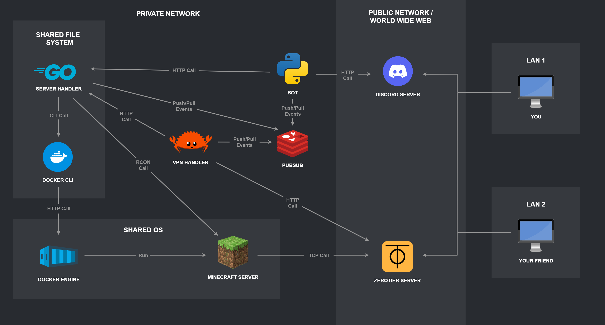

# Admine Developer Guide

## Overview

Admine is a distributed system with four independently deployable components. Each component has its own language, toolchain, and configuration. They communicate exclusively through Redis Pub/Sub — no direct calls between services.

---

## Architecture



### Components

#### 1. Server Handler (Go)
Orchestrates the Minecraft server lifecycle through Docker Compose. On every `Start`, it renders `internal/deployment/docker-compose.yaml.tmpl` with values from `server_handler_config.yaml` and calls `docker compose up`. Supports all [`itzg/docker-minecraft-server`](https://github.com/itzg/docker-minecraft-server) server types (Vanilla, Fabric, Forge, NeoForge, Paper, Modrinth, CurseForge, FTB) and an optional ZeroTier sidecar container. Exposes a REST API consumed by the bot.

#### 2. VPN Handler (Rust)
Manages ZeroTier network membership via the ZeroTier Central REST API. Handles member authorization and network queries. Uses a local Sled database for persistence.

#### 3. Discord Bot (Python)
The user-facing interface. Translates Discord slash commands into Pub/Sub messages and relays responses back to Discord channels. Built with discord.py.

#### 4. Message Bus (Redis)
All inter-component communication flows through three Redis Pub/Sub channels:

| Channel | Purpose |
|---|---|
| `server_channel` | Server lifecycle events (up, down, restarting) |
| `command_channel` | Command routing and results |
| `vpn_channel` | VPN state changes and member updates |

Message envelope format:

```json
{
  "origin": "component_name",
  "tags":   ["event_tag"],
  "message": "payload"
}
```

---

## Repository structure

```
Admine/
├── server_handler/         # Go — lifecycle management + REST API
│   ├── cmd/                # Binary entrypoint
│   ├── internal/           # Business logic (config, deployment, api, pubsub)
│   └── pkg/                # Shared utilities (docker compose wrapper, logger)
├── vpn_handler/            # Rust — ZeroTier integration
│   ├── src/                # Source (api, pub_sub, vpn, persistence)
│   └── etc/                # Config file and log4rs config
├── bot/                    # Python — Discord bot
│   ├── src/bot/            # Bot logic (commands, event handling)
│   └── tests/              # pytest test suite
├── pubsub/redis/           # Redis config and compose file
└── utils/
    ├── releasing/          # Release scripts (make-release.nu)
    │   └── templates/      # Admine-Deploy-Pack deployment template
    ├── pubsub/             # Debugging scripts for pub/sub messages
    └── mocks/apis/         # Mock API compose files for local dev
```

---

## Local development

### Server Handler (Go)

```bash
cd server_handler
make build       # build binary → ./bin/server_handler
make test        # run tests
make clean       # remove build artifacts
./bin/server_handler [config_path]
```

Requires: Go 1.21+, Docker with Compose plugin.

### VPN Handler (Rust)

```bash
cd vpn_handler
cargo build              # debug build
cargo build --release    # release build
cargo test               # run tests
./target/debug/vpn_handler [config_path]
```

Requires: Rust toolchain (stable), a running Redis instance.

### Bot (Python)

```bash
cd bot
make install      # install dependencies via poetry
make test         # run pytest suite
make run          # start the bot
make build-release # build PyInstaller binary → ./dist/bot
```

Requires: Python 3.11+, pyenv, poetry.

### Redis (local)

```bash
cd pubsub/redis
docker compose up -d
```

---

## Commit conventions

This project uses [gitmoji](https://gitmoji.dev/) prefixes.

Example:
```
🐛 fix zerotier sidecar entrypoint not joining network on startup
```

---

## Release

Releases are built with [Nushell](https://www.nushell.sh/) from the repo root:

```bash
nu utils/releasing/make-release.nu <version>

# Options
--clean          # run clean before each build
--force          # overwrite existing output and tags
--dev            # skip git tagging (local iterations)
--push_tags      # push annotated tag to origin (default: false)
--no_archive     # skip tar.gz/zip creation
```

The output is a self-contained `admine-deploy-pack-<os>-<arch>-<version>/` directory ready to be dropped on the target host and started with `./admine.sh start`.

