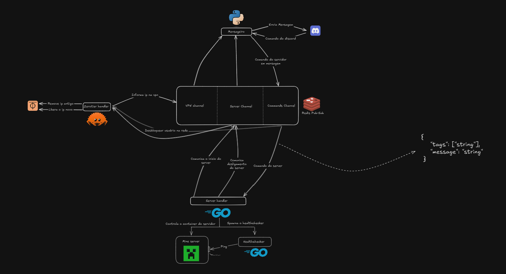

### Admine - Infrastructure Manager for Minecraft Servers

Admine is a comprehensive infrastructure management solution for Minecraft servers running on Linux systems. It leverages Docker for containerization, ZeroTier for VPN connectivity, and Redis for inter-component communication. The system is designed to automate the deployment, monitoring, and management of Minecraft servers, ensuring high availability and ease of use.

### Core Components

1. **Container Management (Go)**
   - **Docker Integration**: Utilizes the `fsouza/go-dockerclient` library to manage Docker containers. This includes starting, stopping, and monitoring the status of Minecraft server containers.
   - **Health Monitoring**: Implements a health checker that continuously monitors the status of the Minecraft server container. If the container is found to be down, it automatically restarts it.
   - **Configuration Management**: Supports configuration via environment variables and YAML files. This allows for flexible and dynamic configuration of the server settings.
   - **CLI Interface**: Provides a command-line interface using the `cobra` library, enabling users to interact with the server manager and perform various operations.

2. **Network Management (Rust)**
   - **ZeroTier Integration**: Uses the ZeroTier API to manage network members. This includes authorizing new members, removing old members, and updating member configurations.
   - **IP Management**: Automates the process of managing IP addresses for the Minecraft server within the ZeroTier network. This ensures that the server is always accessible via a consistent IP address.
   - **Persistence**: Stores the state of network members in a file, allowing for recovery and consistency across restarts.
   - **Error Handling**: Implements robust error handling and logging to ensure that network operations are reliable and any issues are promptly reported.

3. **Command Interface (Python)**
   - **Discord Bot Integration**: Uses the `discord.py` library to create a bot that interacts with users on Discord. The bot can send notifications about the server status and accept commands from users.
   - **Command Routing**: Routes commands from Discord to the appropriate components via Redis Pub/Sub channels. This allows users to control the Minecraft server and manage network settings remotely.
   - **Notification System**: Sends notifications to Discord channels about important events, such as server startup, shutdown, and IP address changes.

4. **Message Bus (Redis)**
   - **Pub/Sub Channels**: Utilizes Redis Pub/Sub to facilitate communication between components. The main channels are:
     - `server_channel`: Used for sending notifications about the server's lifecycle events.
     - `vpn_channel`: Used for sending updates about the server's IP address and network configuration.
     - `command_channel`: Used for routing commands from the Discord bot to the server manager and network manager.
   - **Scalability**: Redis provides a scalable and efficient messaging system that can handle high volumes of messages and ensure timely delivery.

### System Architecture

The system architecture is designed to ensure modularity and separation of concerns. Each component is responsible for a specific aspect of the infrastructure, and they communicate via Redis Pub/Sub channels.

### Pipeline Overview

1. **Server Startup**
   - The server manager (Go) is triggered to start the Minecraft server container using Docker Compose.
   - Once the container is up, the server manager sends a message to the `server_channel` indicating that the server is starting.

2. **Network Configuration**
   - The VPN manager (Rust) listens to the `server_channel` for server startup messages.
   - Upon receiving a startup message, the VPN manager removes the old IP address from the ZeroTier network and authorizes the new server IP.
   - The new IP address is then published to the `vpn_channel`.

3. **Notification and Command Handling**
   - The Discord bot (Python) listens to both the `server_channel` and `vpn_channel`.
   - When a new IP address is published to the `vpn_channel`, the bot sends a notification to the designated Discord channel.
   - Users can send commands to the bot, which are then published to the `command_channel`.

4. **Command Execution**
   - The server manager and VPN manager listen to the `command_channel` for commands.
   - Commands related to server operations are handled by the server manager, while network-related commands are handled by the VPN manager.