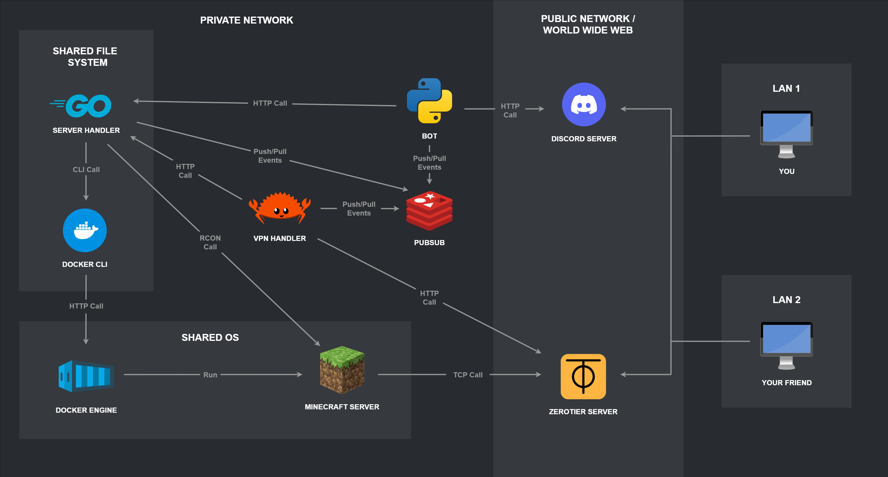

# Admine - Infrastructure Manager for Minecraft Servers

Admine is a comprehensive infrastructure management solution for Minecraft servers running on Linux systems. It provides automated server lifecycle management, VPN connectivity through ZeroTier, and Discord-based administration interface.

## What is Admine?

Admine automates the complete management of Minecraft servers in a containerized environment, solving the common problem of running servers behind NAT (Network Address Translation) or in private networks where direct public access isn't available. The system is designed for server administrators who want to host Minecraft servers in private networks (home networks, cloud instances behind NAT, etc.) while providing secure and easy access to players through VPN connectivity.

## System Architecture

## Command Interface

Users can interact with the system through Discord commands:

- `/on` - Start the server
- `/off` - Stop the server
- `/restart` - Restart the server
- `/status` - Get server status
- `/info` - Get server information
- `/command <cmd>` - Execute Minecraft commands
- `/auth <id>` - Authorize VPN member
- `/vpn_id` - Get VPN network ID
- `/server_ips` - Get server IP addresses
