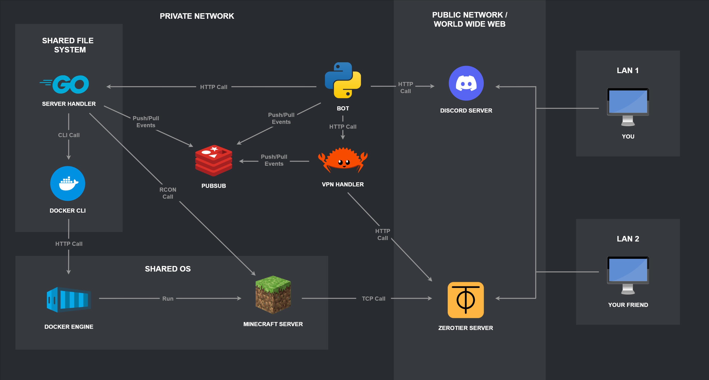

# Admine - Infrastructure Manager for Minecraft Servers

Admine is a comprehensive infrastructure management solution for Minecraft servers running on Linux systems. It provides automated server lifecycle management, VPN connectivity through ZeroTier, and Discord-based administration interface.

## What is Admine?

Admine automates the complete management of Minecraft servers in a containerized environment, solving the common problem of running servers behind NAT (Network Address Translation) or in private networks where direct public access isn't available.

**Key Features:**
- **Automated Server Management**: Start, stop, restart, and monitor Minecraft servers through Docker containers
- **VPN Integration**: Seamless ZeroTier VPN management that allows players to connect to private servers as if they were on a local network
- **NAT Traversal**: Enables server hosting even when behind firewalls, routers, or restricted network environments
- **Discord Interface**: User-friendly Discord bot for server administration and monitoring
- **Multi-Version Support**: Compatible with Vanilla, Forge, and Fabric servers
- **Real-time Communication**: Redis-based messaging between system components

The system is designed for server administrators who want to host Minecraft servers in private networks (home networks, cloud instances behind NAT, etc.) while providing secure and easy access to players through VPN connectivity.

## System Architecture

The architecture demonstrates how Admine enables players to connect to private Minecraft servers through VPN connectivity:

**Network Topology:**
- **Private Network**: Contains the Minecraft server infrastructure (Docker containers, handlers, Redis)
- **Public Network**: Discord server and ZeroTier service for external communication
- **Player Networks (LAN 1, LAN 2)**: Players behind their own NAT/firewalls

**Connection Flow:**
1. **Server Management**: Discord bot communicates with handlers via HTTP calls
2. **VPN Connectivity**: ZeroTier creates a virtual network overlay connecting all participants
3. **Player Access**: Players join the ZeroTier network and can directly access the private Minecraft server
4. **Administration**: All management happens through Discord commands, regardless of network location

This design allows hosting Minecraft servers in any private network while providing seamless access to players worldwide.

## Core Components

### 1. Server Handler (Go)
The `server_handler` component manages Minecraft server containers:

- Starts, stops, and monitors server containers
- Provides REST API endpoints for server control
- Executes Minecraft commands via RCON
- Collects server status information (health, TPS, uptime)
- Detects server type (Vanilla, Forge, Fabric, etc.)

### 2. VPN Handler (Rust)
The `vpn_handler` component manages network connectivity:

- Manages ZeroTier network members and authorizations
- Automates IP address assignments
- Provides an API for VPN operations
- Persists network state in a key-value store

### 3. Discord Bot (Python)
The `bot` component provides the user interface:

- Processes commands from Discord users
- Displays server status and information
- Controls access to administrative commands
- Sends notifications about server events
- Routes commands to appropriate components

### 4. Message Bus (Redis)
The system uses Redis Pub/Sub for communication between components:

- `server_channel`: Server lifecycle events
- `command_channel`: Command routing
- `vpn_channel`: Network configuration updates
## Minecraft Server Support

The `minecraft_server` directory contains Docker configurations for:

- Forge servers
- Fabric servers
- Support for various Minecraft versions

## Command Interface

Users can interact with the system through Discord commands:

- `/on` - Start the server
- `/off` - Stop the server
- `/restart` - Restart the server
- `/status` - Get server status
- `/info` - Get server information
- `/command <cmd>` - Execute Minecraft commands
- `/auth <id>` - Authorize VPN member
- `/vpn_id` - Get VPN network ID
- `/server_ips` - Get server IP addresses
## API Endpoints

### Server Handler
The server handler provides REST API endpoints:

- `GET /api/v1/info` - Get server information
- `GET /api/v1/status` - Get server status
- `POST /api/v1/command` - Execute commands

### VPN Handler
The VPN handler provides REST API endpoints:

- `GET /server-ips` - Get server IP addresses in VPN
- `GET /vpn-id` - Get internal VPN network ID
- `POST /auth-member` - Authorize a member on VPN network